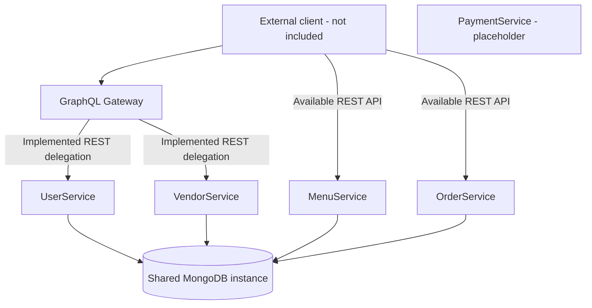
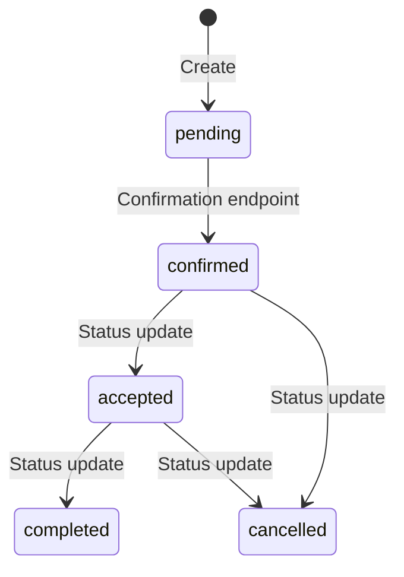

# MunchMap architecture and coding practices

**The architecture and coding practices documented here MUST be followed STRICTLY by every contributor and agent working on this project.** Read this file before adding, moving, or modifying code. Keep each responsibility in its designated service and layer.

These rules formalize the existing project structure. Current implementation limitations are identified separately; they are not patterns to copy. If a task requires a different architectural boundary, a new layer, or an ambiguous domain decision, ask the user before making that change. Update this document when an authorized change affects its rules.

## 1. Service boundaries

MunchMap is a multi-service backend in a single repository. Each implemented application has its own package manifest, lockfile, TypeScript configuration, entry point, and Dockerfile.

| Directory | Responsibility | Code that belongs here |
| --- | --- | --- |
| `Gateway/` | Client-facing GraphQL API and REST delegation | GraphQL schemas, resolvers, service HTTP adapters, GraphQL context, and cookie forwarding |
| `UserService/` | Identity and user accounts | Registration, login/logout, passwords, profiles, account deletion, JWT generation, and admin user management |
| `VendorService/` | Food outlets | Outlet records, outlet details, opening hours, and open/closed status |
| `MenuService/` | Food catalog | Menu items, descriptions, prices, categories, image URLs, and availability |
| `OrderService/` | Orders and fulfillment | Order records, ordered-item snapshots, totals, order numbers, retrieval, and status transitions |
| `PaymentService/` | Payment domain placeholder | Future payment functionality, once its requirements and integration are agreed |

**STRICTLY preserve domain ownership.** Do not put order business logic in the gateway or menu service, account operations in the vendor service, or payment processing in an unrelated controller.

Services must not import another service's controllers or Mongoose models, or directly operate on another domain's collections. Use an explicit service API when cross-domain communication is required. The gateway delegates to domain services over HTTP and must not acquire database models or business-rule implementations.

### Current topology



User/auth/admin and vendor operations are exposed through GraphQL. Menu and order services have REST endpoints but no gateway modules yet. The client arrows describe API access, not an existing frontend. The gateway uses REST adapters, not Apollo Federation.

## 2. Domain service layout: follow STRICTLY

```text
<Service>/
  package.json
  package-lock.json
  tsconfig.json
  dockerfile
  src/
    index.ts
    routes/
    controllers/
    models/
    types/
    config/
    utils/
    middleware/           UserService's existing spelling
    middlewares/          MenuService and OrderService's existing spelling
```

The middleware folders above are service-specific alternatives, not two folders to create in every service. `VendorService`, `MenuService`, and `OrderService` use `middlewares/`; `UserService` uses `middleware/`. `PaymentService` has no `src` implementation. Preserve the established spelling in each existing service rather than creating parallel folders or renaming them incidentally.

| Location | Responsibility | Placement rule |
| --- | --- | --- |
| `src/index.ts` | Startup, Express middleware registration, route mounting, database initialization, listening | Keep endpoint implementations and business rules out of the entry point |
| `src/routes/` | HTTP methods, paths, controller bindings, authentication and role middleware attachment | Routes dispatch requests; do not put database queries or order calculations here |
| `src/controllers/` | Request validation, domain behavior, database operations through local models, HTTP status and response construction | Existing business logic lives here; do not introduce a separate service/repository layer without an agreed architecture change |
| `src/models/` | Mongoose schemas, model interfaces, persisted fields, defaults, constraints, timestamps | Keep persistence definitions here, not in routes, gateway resolvers, or request-type files |
| `src/types/` | Request-body and other reusable TypeScript contracts | Define input shapes here; do not create Mongoose models or execute requests here |
| `src/config/` | Infrastructure connection setup | Database connection initialization belongs here |
| `src/utils/` | Small reusable helpers and runtime configuration exports | Follow existing helpers such as `config.ts`, `handleError.ts`, and `generateToken.ts`; do not turn utilities into a second business-logic layer |
| Existing middleware folder | JWT verification, request identity, role checks | Attach protection in routes; perform resource-specific ownership checks alongside the relevant domain operation |

The normal request path is:

```text
Express entry point -> route -> applicable middleware -> controller
                    -> local Mongoose model -> MongoDB -> HTTP response
```

## 3. GraphQL division: follow STRICTLY

GraphQL belongs in `Gateway/src/graphql/`. Keep schema definitions, resolvers, and HTTP adapters separate. Do not collapse them into a single file.

```text
Gateway/src/
  index.ts
  graphql/
    createApolloGraphqlServer.ts
    schema/
      base.schema.ts
      auth.schema.ts
      user.schema.ts
      admin.schema.ts
      vendor.schema.ts
      index.ts
    resolvers/
      auth.resolver.ts
      user.resolver.ts
      admin.resolver.ts
      vendor.resolver.ts
      index.ts
    loaders/
      auth.api.ts
      user.api.ts
      admin.api.ts
      vendor.api.ts
    utils/
      buildCookieHeader.ts
      handleError.ts
  types/
    user.types.ts
    vendor.types.ts
    apiError.types.ts
  utils/
    context.ts
    config.ts
  config/
    redis.ts              empty placeholder
    rabbitmq.ts           empty placeholder
```

### Schema rules

- Put shared GraphQL types and root `Query`/`Mutation` definitions in `schema/base.schema.ts`. Reuse existing shared types such as `User` and `BasicResponse`.
- Put each domain's operation definitions, domain response types, and inputs in its own `schema/<domain>.schema.ts` file.
- Use `extend type Query` and `extend type Mutation` in domain modules, matching the existing pattern.
- Register every schema module in `schema/index.ts`, which exports the `typeDefs` collection.
- Do not embed schemas inside resolvers, adapters, or `Gateway/src/index.ts`.

### Resolver rules

- Put each domain's resolver map in `resolvers/<domain>.resolver.ts`.
- Resolvers receive arguments and `GQLContext`, delegate to the corresponding API adapter, and return its result. Keep them thin.
- Compose `Query` and `Mutation` maps in `resolvers/index.ts` using the existing object-spread pattern. Do not silently overwrite an existing operation name.
- Do not put Axios requests, Mongoose queries, password hashing, or domain state-transition rules in resolvers.

### HTTP adapter rules

- Put service HTTP calls in `loaders/<domain>.api.ts`. Despite the folder name, these are Axios adapters, not DataLoader batching implementations.
- Keep downstream URLs, request bodies, timeout settings, credential forwarding, and downstream-error translation in these modules.
- Use the existing `buildCookieHeader` helper for request-cookie forwarding and `setResponseCookies` for operations that change response cookies.
- Follow the existing five-second request timeout unless the task calls for a deliberate change.
- Use `graphql/utils/handleError.ts` for the existing downstream-error response convention.
- Read service base URLs from runtime configuration. User-service adapters append `/auth`, `/users`, and `/admin`, so `USER_SERVICE_URL` must include the service's `/api` prefix.
- Vendor adapters read `VENDOR_SERVICE_URL`, including `/api/vendor`. Forward the existing token cookie for every vendor call, including browsing so that verified admins retain visibility. Vendor authorization, validation, ownership, and state changes remain in VendorService. Keep vendor document IDs and account IDs distinct in gateway inputs.
- Vendor GraphQL response payloads are nullable so REST failures can return `success: false`, `message`, and optional field validation `errors` without GraphQL null-propagation errors. The public `Vendor` type excludes the account association and internal version key.

### Context and TypeScript contract rules

- Request-scoped Express objects, cookies, token, and headers belong in `Gateway/src/utils/context.ts` and its `GQLContext` interface.
- Reusable gateway input and response interfaces belong in `Gateway/src/types/`. Existing account contracts live in `user.types.ts`; new domains should have corresponding domain type files.
- Keep GraphQL SDL, TypeScript interfaces, adapter payloads, and REST responses aligned. A TypeScript cast does not resolve a runtime mismatch.
- Apollo construction belongs in `graphql/createApolloGraphqlServer.ts`; Express startup and `/graphql` mounting belong in `Gateway/src/index.ts`.

### Example: adding an authorized menu GraphQL operation

1. Implement or reuse the menu REST operation in `MenuService`, with its route, controller, local model, and request contract in the appropriate folders.
2. Add the menu SDL to `Gateway/src/graphql/schema/menu.schema.ts`.
3. Add gateway menu contracts to `Gateway/src/types/menu.types.ts`.
4. Add the REST adapter to `Gateway/src/graphql/loaders/menu.api.ts`.
5. Add the thin resolver to `Gateway/src/graphql/resolvers/menu.resolver.ts`.
6. Register the schema and resolver in their respective `index.ts` composition files.
7. Check the full contract and credential flow through the gateway and service.

This is a placement guide for future authorized work; these menu gateway files do not currently exist.

## 4. Coding practices: follow STRICTLY

### TypeScript and contracts

The implemented applications use TypeScript with ES2020 output and CommonJS modules. Preserve the existing strict compiler options: `strict`, `noImplicitReturns`, `noUnusedLocals`, `noUnusedParameters`, `noFallthroughCasesInSwitch`, `noUncheckedIndexedAccess`, and `exactOptionalPropertyTypes`.

Do not disable these settings to make a change compile. Type request parameters, bodies, responses, and authenticated identity in their correct Express generic positions. Reuse existing domain interfaces; use `unknown` and narrowing for untrusted values and caught errors rather than adding unchecked `any` or assertions. Existing uses of `any` are limitations, not the preferred pattern for new code.

Runtime validation belongs at the service request boundary; TypeScript types alone do not validate incoming JSON. Persisted constraints belong in Mongoose schemas. Keep updateable fields explicit and apply relevant schema validation when changing records.

### Naming and modularity

Follow the naming and export conventions of the service being edited. Existing domain files use names such as `vendorController.ts`, `menuRoutes.ts`, and `createMenuBody.ts`; order routes use `orderRouter.ts`. Gateway modules use `<domain>.schema.ts`, `<domain>.resolver.ts`, and `<domain>.api.ts`.

Reuse existing helpers and modules before adding duplicates. Keep reusable input contracts in `types/`, route registration in `routes/`, and behavior in `controllers/`. Avoid unrelated renames, mass formatting, dependency changes, or folder restructuring in a feature fix.

### Async operations and responses

Use the existing `async`/`await` style for network and database operations, with errors handled at the appropriate controller or adapter boundary. REST responses follow `{ success, message, ...payload }`; gateway response types must reflect that structure. Use meaningful HTTP statuses and preserve documented payload names.

Reuse each service's existing error helper where available. The user service currently handles errors inline; do not assume it already has a shared helper. Avoid returning secrets or logging authentication cookies, tokens, password hashes, or complete requests.

### Authentication and domain authorization

JWT generation belongs to `UserService`; verification and role middleware remain in the relevant domain service. Tokens are currently read from the `token` cookie and verified using `JWT_KEY`. The gateway forwards cookies to downstream services and relays cookie changes to the client.

Keep route protection visible in the route module. Place resource-ownership and domain-specific checks with the relevant controller operation. Reuse account password hashing and password-exclusion patterns. Do not copy an existing missing authorization check or full-user authentication response into new code.

### Configuration and infrastructure

Keep runtime values in environment configuration and existing configuration modules. Do not commit secrets or generated `dist/` and `node_modules/` directories. Preserve exact directory casing in references and build contexts.

Each service owns its dependency manifest, lockfile, compiler configuration, and Dockerfile. Container orchestration belongs in root `docker-compose.yaml`. Do not assume a root npm workspace exists. Redis and RabbitMQ files are empty placeholders; using either requires an agreed integration rather than treating them as operational dependencies.

Gateway and VendorService expose `typecheck` (`tsc --noEmit`), runnable with `pnpm --dir Gateway typecheck` and `pnpm --dir VendorService typecheck`. Dependency installation remains `npm ci` using the existing npm lockfiles. Their local `pnpm-workspace.yaml` files disable automatic dependency replacement before script execution; they do not create a shared root workspace. Add explicit portable exported types when necessary, rather than weakening compiler settings.

VendorService uses a two-stage Node 22 image, production-only runtime dependencies, and a non-root runtime user. Gateway also uses Node 22 to satisfy Apollo's runtime requirements. Root Compose is currently for local development: VendorService is published at `localhost:3001` (container port 3000), UserService at `localhost:3002`, and Gateway at `localhost:3000`. Gateway receives both internal service base URLs. Compose uses ordinary startup dependencies without health checks or readiness conditions; container startup order does not guarantee database or API readiness. UserService and VendorService share a development-only JWT key fallback so local startup needs no extra environment setup; `JWT_KEY` can override it. Production configuration and hardening are deferred until explicitly requested by the user. Never commit a real signing key.

### Verification and documentation

For code changes, run the affected implemented service's `npm run build` and relevant checks for the behavior changed. Gateway contract changes need validation on both sides of the HTTP boundary. Report pre-existing failures and unavailable checks accurately; do not weaken compiler rules or claim unperformed verification.

`VendorService` has Node's built-in test runner and MongoDB integration tests under `tests/`; `npm test` builds the service and runs them against a temporary MongoDB process using `mongodb-memory-server-core`. Gateway's `npm test` builds it and tests the vendor GraphQL-to-HTTP contracts against a local HTTP test server, including cookie forwarding, pagination, errors, and public field visibility. Other services do not currently have substantive automated tests. ESLint, Prettier, and a CI pipeline are not configured. Keep project-purpose content in `Readme.md`, and architecture, code placement, and contributor rules in this file. Root `AGENTS.md` directs agents to this document.

### VendorService-specific rules

- Create an outlet only after vendor login. `requireVendor` in `src/middlewares/authMiddleware.ts` verifies the existing `token` cookie, permits the `vendor` role only, and sets `vendorUserId` to the account ID. Administrators cannot write outlet records.
- The outlet's `user` association is immutable and derived from authenticated identity. It is distinct from the outlet document `_id`. Every update filters by both `_id` and `user` atomically; unknown or unowned outlets return 404.
- New outlets start DEACTIVATED (`isActive: false`) and CLOSED (`isOpen: false`). Opening hours are display-only. One outlet per account is enforced by the unique `user` index, including concurrent creation; conflicts return 409.
- Runtime request schemas and inferred input types live in `src/types/createVendorBody.ts`. `src/middlewares/validateRequest.ts` applies these Zod schemas at the route boundary. Unknown fields and invalid types are rejected. Controllers keep domain logic; runtime validation does not replace ownership checks.
- Optional campus, outlet description, image URL, and phone are editable outlet details. Campus and location are free text. Phone is a string; image URLs are HTTP(S) references, not an upload integration. No new arbitrary length limits or phone-country rules have been imposed.
- Public responses omit `user` and the internal version key. They retain the outlet document ID and outlet details. Activated outlets remain listed when CLOSED. Deactivated outlets are excluded from non-admin listings and return 404 on non-admin lookup by outlet ID or user ID. Admin visibility requires a verified admin JWT, but admins still cannot write outlets. Owners can retrieve their own deactivated outlet through `/me` and manage it.
- Activation/deactivation use dedicated actions, separate from OPEN/CLOSE and general details editing. Deactivation atomically sets `isActive: false` and `isOpen: false`; opening atomically requires `isActive: true`, preventing simultaneous OPEN and deactivation from leaving an inactive outlet open. Activation alone does not open a newly created or deactivated outlet. General edits cannot change `user`, `isActive`, or `isOpen`.
- Listings accept `offset` (default 0) and `limit` (default 10). Both are integers; offset is nonnegative and limit is positive. No separate business page-size cap has been specified. Responses include `vendors`, `total` matching the viewer's visibility filter, `offset`, `limit`, and `count` returned. Sort by `_id` ascending to keep offset paging deterministic. Page results and totals are separate reads and may differ if records change during a request.
- Updates currently use the latest write to a field, without stale-edit rejection, as requested. Records without an explicit persisted `isActive: true` are hidden from non-admin browsing; no existing database records are automatically migrated.
- `MONGO_URI` takes precedence for connection details; otherwise explicit `MONGO_USERNAME` and `MONGO_PASSWORD` are required. `MONGO_DB_NAME` defaults to `vendordb` and explicitly selects that database even when the URI omits a database or names another one. Startup awaits database connection and requires `JWT_KEY`.
- Services are intended to communicate through the gateway. Wildcard credentialed CORS is deliberately retained in VendorService at the user's request while backend development continues; CORS hardening is deferred. This setting does not enforce gateway-only network access.

#### Vendor REST endpoints

All paths are relative to `/api/vendor`:

| Method and path | Access | Purpose |
| --- | --- | --- |
| `POST /` | Vendor | Create an outlet after login; owner derived from JWT |
| `GET /me` | Vendor | Retrieve own outlet, including when deactivated |
| `GET /?offset=0&limit=10` | Public; admin JWT reveals deactivated outlets | List outlets with pagination and viewer-specific totals |
| `GET /:vendorId` | Public; admin JWT reveals deactivated outlets | Lookup by outlet document ID |
| `GET /user/:userId` | Public; admin JWT reveals deactivated outlets | Existing lookup by account ID; response still omits account association |
| `PUT /:vendorId` | Owning vendor | Partially update outlet details |
| `PATCH /:vendorId/status` | Owning vendor | Set OPEN/CLOSE using `{ "isOpen": true/false }`; activation required for OPEN |
| `PATCH /:vendorId/activate` | Owning vendor | Activate an outlet; no request body needed |
| `PATCH /:vendorId/deactivate` | Owning vendor | Deactivate and close an outlet; no request body needed |

Creation requires `outletName` and `location`; `campus`, `openingHours`, `description`, `imageUrl`, and `phone` are optional. Zod request validation stays in the existing types/middleware layers. Parsed query data is passed through `res.locals.validatedQuery` because Express 5 exposes query parameters through a getter.

## 5. Persistence and domain behavior

Compose runs a shared MongoDB instance with persistent `mongo_data` storage. Default logical databases are `userdb` for user, `vendordb` for vendor, `menudb` for menu, and `orderdb` for orders. These settings do not authorize cross-domain database access.

Models relate records through ObjectIds: vendors associate with users, menus have a vendor field, and orders record user/vendor IDs and embedded item snapshots. Referential existence is not currently enforced through cross-service lookups or Mongoose population.

The current order transitions are:



Transition enforcement belongs in `OrderService/src/controllers/orderController.ts`; allowed persisted statuses belong in `OrderService/src/models/Order.ts`. Do not introduce new transition semantics in gateway resolvers. Changes to payment confirmation, cancellation rules, numbering scope, or timezone require clarification when the task does not define them.

## 6. Existing limitations: do not mistake these for architectural rules

- `Menu.vendor` is described as a vendor reference, but menu creation stores the authenticated user ID. Ask which identity is intended before changing related contracts or queries.
- GraphQL contact values are strings, while the user model stores a number. Order-creation interfaces also differ from the actual ordered-item shape. Resolve contract changes deliberately across their consumers.
- Vendor write routes now require vendor authentication and ownership. Several menu/order operations still lack ownership checks. Public registration accepts privileged roles, and direct authentication REST responses include password hashes.
- Order totals currently use caller-supplied prices, confirmation has no payment verification, and daily order numbering is not atomic. These are correctness gaps, not endorsed practices.
- User/menu/order connection code ignores the `MONGO_URI` supplied by Compose; VendorService honors it. Compose supplies the shared JWT key to UserService and VendorService, but menu/order configuration remains incomplete.
- Gateway and VendorService use Node 22 images; other service runtime images remain inconsistent.
- User/menu/order services do not await database initialization before listening; VendorService now does. Services use wildcard credentialed CORS; VendorService retains it by explicit user instruction for now. Secure-cookie behavior needs suitable environment configuration.
- `npm start` uses `ts-node`; implemented Dockerfiles build and run `dist/index.js`. Development/production script and Docker separation remain existing TODOs.
- `PaymentService` has no application code or build script and is absent from Compose. Do not infer a provider, webhook contract, or payment workflow from the placeholder.

Correct these only within the authorized task. When requirements or intended semantics are unclear, ask the user instead of inventing behavior or changing service boundaries.
